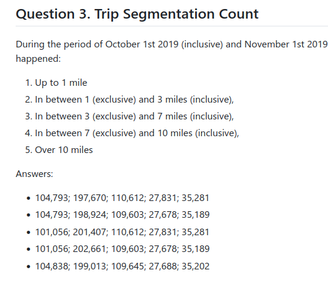

# Docker + SQL

[homework itself](https://github.com/DataTalksClub/data-engineering-zoomcamp/blob/main/cohorts/2025/01-docker-terraform/homework.md)

## Note on Q3: distance binning

The question sounds ill-formed.

<details>
<summary>md5sum, counts, questions and options</summary>



```bash
 $ md5sum ../nyc_taxi_data/green_tripdata_2019-10.csv.gz
4a3777cea8ad873e569d788ee3694969  ../nyc_taxi_data/green_tripdata_2019-10.csv.gz
 $ zcat green_tripdata_2019-10.csv.gz | wc -l
476387
```

Furthermore, there are 2 routes with negative length, that _technically_ also fall under "up to 1 mile".
Further probing yields that we don't need to drop invalid entries.

Trips happened before or after 'October 2019':

```bash
 $ zcat nyc_taxi_data/green_tripdata_2019-10.csv.gz | awk -F, '{print $2}' | awk '{print $1}' | sort | uniq -c | grep -v 2019-10
      1 2008-10-21
      3 2008-12-31
      5 2009-01-01
      3 2010-09-23
      2 2019-09-19
      1 2019-09-30
     15 2019-11-01
      1 2019-11-08
      1 2019-11-13
      1 lpep_pickup_datetime
```
</details>


## Note on Q4: longest trip

The resulting trip duration seems to be a bit much (and the trip was 515 miles)

It was also very cheap compared to others and on the end of the month. SUSPICIOUS!
